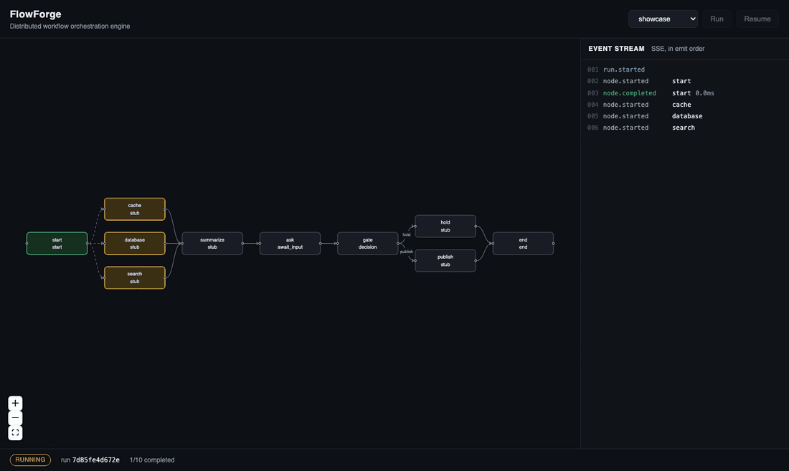
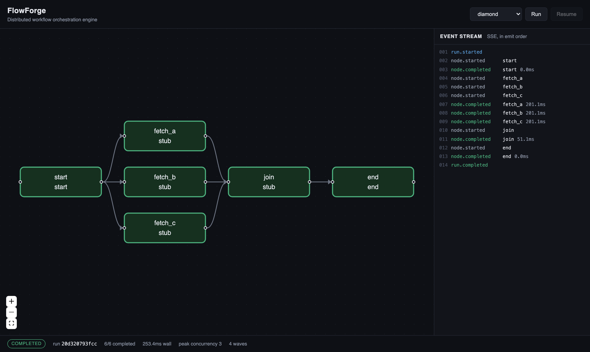
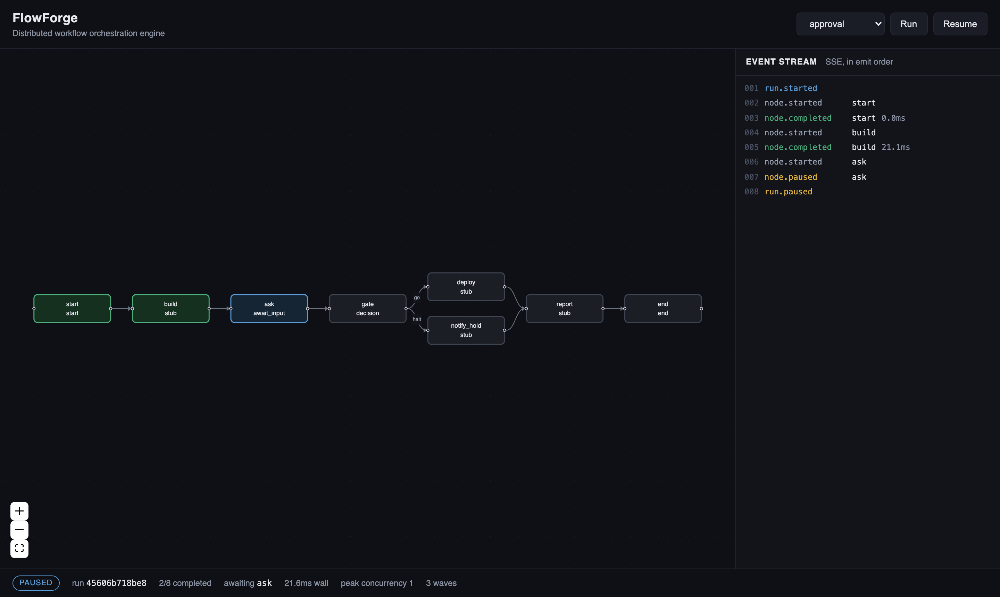
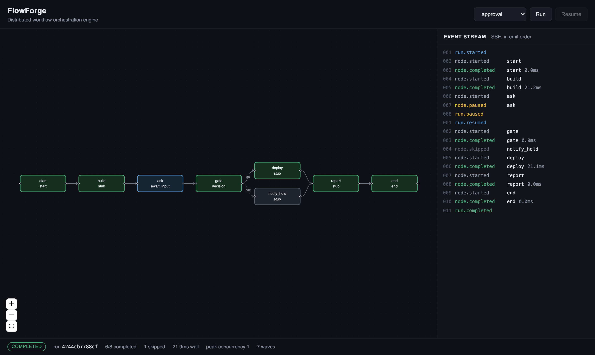
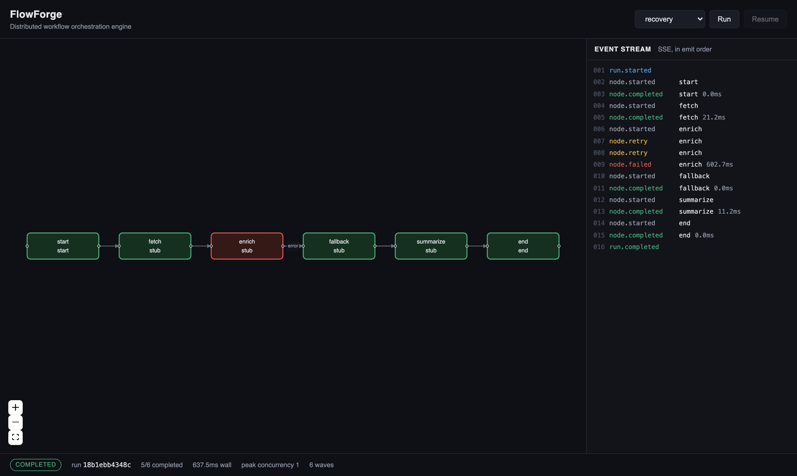
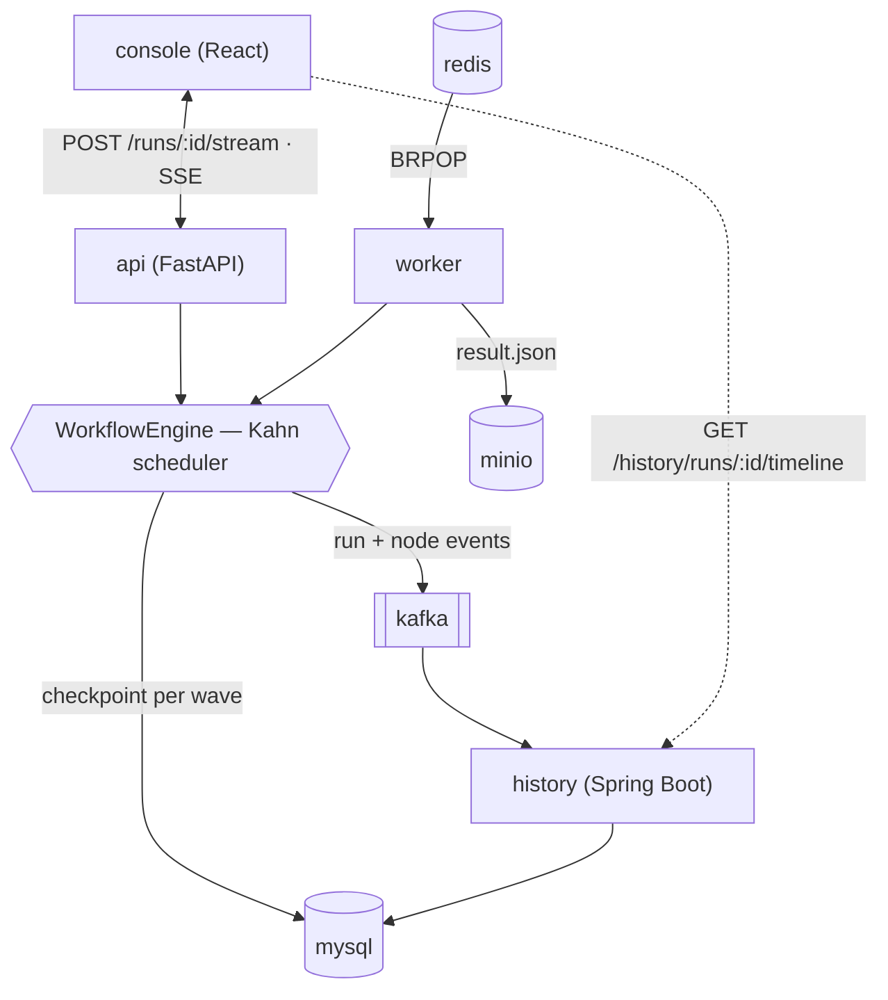

# FlowForge

[](https://github.com/YuemengZheng/flowforge-workflow-engine/actions/workflows/tests.yml)

A DAG workflow engine in Python. Nodes are declared in JSON; the engine resolves
dependencies, runs everything that can run at once concurrently, and streams
what happens as Server-Sent Events. The core is **standard library only** — the
engine, both HTTP surfaces, the Redis store, the S3 client and the MCP gateway
need nothing installed.

Design reference: the architecture of iFlytek `astron-agent` / PaiFlow
(Apache 2.0). The scheduler here is a from-scratch implementation built on a
different core mechanism — see *Why Kahn* below.

## What it looks like



Three parallel nodes light up as one wave, the run stops at an `await_input`
node, and answering it resumes from the checkpoint. The screenshots below are
generated, not staged — `scripts/capture_console.mjs` drives headless Chrome over
the DevTools Protocol against a real backend:

| | |
|---|---|
|  |  |
| **Parallel execution.** One wave, three nodes, `peak concurrency 3` in the footer. | **Paused.** The run is waiting on `ask`; the checkpoint is in the store. |
|  |  |
| **Resumed.** After `run.resumed`, `start` and `build` never reappear — they were restored, not re-executed. `notify_hold` is dashed: skipped. | **Failure.** `enrich` retries twice, fails, takes its `error` edge; `fallback` carries the run to completion. |

```bash
python3 -m flowforge serve examples --port 8000     # backend
cd console && npm install && npm run dev            # http://localhost:5273
node scripts/capture_console.mjs                    # regenerate the screenshots
node scripts/capture_console.mjs http://localhost:5273 docs --frames \
  && python3 scripts/build_gif.py                   # regenerate the GIF
```

## Architecture



`redis` is the job queue, `mysql` holds both checkpoints and the projected run
history, `minio` holds run artifacts, `kafka` carries the event topic.

The engine is a library; `api` and `worker` are two ways to drive it and they share
the run store, so a run the **worker** pauses is answered through the **api**.
Events go to Kafka as well as to the SSE stream, and the Java service folds that
topic into queryable history — the only component that answers "what ran
yesterday", because a checkpoint is deleted when its run finishes.

## Status

| Stage | Scope | State |
|---|---|---|
| **T1** | JSON → DAG, in-degree table, cycle detection, Kahn ready-queue scheduler, node registry | ✅ |
| **T2** | Conditional branching with skip propagation, variable pool with `{{node.field}}` resolution | ✅ |
| **T3** | `asyncio.Queue` producer/consumer streaming over SSE, HTTP server, per-node timeout + retry, LLM node | ✅ |
| **T4** | Checkpointed pause/resume, Redis-backed run store, benchmarks, containers | ✅ |
| **T5** | Per-wave checkpointing and crash recovery, MCP tool gateway, Redis/HTTP connection pooling, SQL checkpoint store, compiled template resolution, adapters for 12 model APIs | ✅ |
| **T6** | FastAPI service layer over a shared service core, queue worker, MinIO artifact store, five-service compose | ✅ |
| **T7** | Run events published to Kafka over a hand-written protocol client, six-service compose | ✅ |
| **T8** | Java/Spring Boot history service projecting the event topic into queryable run history; seven-service compose | ✅ |

## Try it

Python 3.10+, and nothing to install for any of the commands below. Three
per-feature extras cover the rest: `api` (fastapi + uvicorn) for the FastAPI
service layer, `mysql` (pymysql) for the SQL store, `anthropic` for that
provider. `pip install '.[dev]'` adds httpx and runs the API tests too.

```bash
python3 -m unittest discover -s tests -t .
```

```bash
python3 -m flowforge run examples/triage.json --inputs '{"severity":9}'
```

```bash
python3 -m flowforge serve examples --port 8000
```

Then, from another shell — the tokens arrive as they are produced, not at the end:

```bash
curl -sN -X POST localhost:8000/runs/research/stream -d '{"inputs":{"audience":"a hiring manager"}}'
```

```
id: 9
event: node.delta
data: {"node": "draft", "text": "Write about kahn", "index": 0, "type": "node.delta", "seq": 9, ...}
```

Endpoints: `GET /health`, `GET /workflows`, `GET /runs` (paused ones),
`POST /runs/<workflow>` and `/stream` to start, `POST /runs/<run_id>/resume` and
`/resume-stream` to answer one.

## Pause and resume

An `await_input` node stops the run and asks a question. The engine checkpoints
the scheduler's own state — the in-degree counters, which edges were taken,
every node record, the variable pool — and returns `status: paused` with the
prompt. Answering resumes from exactly there:

```bash
curl -s -X POST localhost:8000/runs/approval
# {"status":"paused","awaiting":{"ask":{"prompt":"Deploy a1b2c3d to production? ..."}}}

curl -s -X POST localhost:8000/runs/<run_id>/resume -d '{"answers":{"ask":{"approved":true}}}'
# {"status":"completed", ... "message":"sha a1b2c3d -> go (deployed: a1b2c3d)"}
```

Completed nodes are **not** re-executed — their recorded durations survive the
round trip, which is what `tests/test_checkpoint.py` asserts. The answer lands in
the pool as `{{ask.approved}}`, so a decision node downstream branches on it and
the untaken branch is skipped exactly as in any other run. A workflow can pause
any number of times.

Checkpoints are fingerprinted against the graph (ids, types, config, edges);
resuming against a workflow that has changed since the pause is refused rather
than silently run against a different prompt.

`FLOWFORGE_REDIS=redis:6379` (or `--redis`) puts paused runs in Redis so the
answer can reach a different worker than the one that asked. The Redis client is
RESP over `asyncio.open_connection` rather than a dependency.

## Where checkpoints live

Redis is the default because a paused run is short-lived, keyed, and expires on
its own. SQL earns its place when a checkpoint has to outlive a cache — a run
nobody answers until next week, or a record that survives a `FLUSHALL`. Both
implement the same `RunStore` protocol, so the engine cannot tell them apart:

```bash
python3 -m flowforge serve examples --redis 127.0.0.1:6379
python3 -m flowforge serve examples --mysql root:secret@127.0.0.1:3306/flowforge
python3 -m flowforge serve examples --sqlite runs.db
```

SQL costs two things Redis gives away, and `sql.py` supplies both. **Expiry** is
a column rather than `EX`: `load` filters on it and sweeps the row it just
rejected, so a lapsed checkpoint can never be resumed even while it is still
physically present. **Upsert** is per-dialect — resuming rewrites a run's row,
and sqlite wants `ON CONFLICT(run_id) DO UPDATE` while MySQL wants
`ON DUPLICATE KEY UPDATE`. That pair, plus the column types, is all `Dialect`
holds; adding Postgres means adding one of them.

The drivers are synchronous, so each call runs in a worker thread via
`asyncio.to_thread` and the loop is never blocked on a socket it cannot see.
Connections come from a small bounded pool for the same reason Redis has one: a
wide wave writes its frontier all at once. `MYSQL` uses `LONGTEXT`, not `TEXT` —
a 500-node checkpoint exceeds 64 KiB, and a non-strict server would truncate it
silently.

`tests/test_sql.py` keeps every assertion in one `StoreContract` class that both
backends run unchanged: sqlite always (standard library, no daemon), MySQL when
`FLOWFORGE_TEST_MYSQL=host:port` is set. Verified against **MySQL 8.4.11** — all
35 tests pass, and `serve --mysql` was driven through a real pause → row in the
table → resume → row deleted.

```bash
docker run -d --rm --name ff-mysql -p 3399:3306 \
  -e MYSQL_ROOT_PASSWORD=flowforge -e MYSQL_DATABASE=flowforge mysql:8.4
```

```bash
FLOWFORGE_TEST_MYSQL=127.0.0.1:3399 python3 -m unittest discover -s tests -t .
```

MySQL needs `pip install 'flowforge[mysql]'` (PyMySQL); sqlite needs nothing.

## Surviving a crash

Pausing for input is a planned stop, and the checkpoint written at that moment
is the same object a crash would need. `checkpoint_every_wave=True` writes one
after **every** wave settles, which turns the same machinery into crash
recovery: a process that dies loses at most the wave that was in flight, and
`store.load(run_id)` plus `engine.resume(checkpoint)` picks the run back up.

The timing is the part that matters. The write happens *after* the wave has
settled, never mid-wave, so what lands is a consistent frontier — every node in
it either finished or never started, and nothing in flight is ever recorded as
done. Restarting from it therefore cannot skip work that did not actually
complete, which is the failure a naive "save as you go" produces.

```python
engine = WorkflowEngine(graph, store=RedisRunStore(), checkpoint_every_wave=True)
```

It costs one store round trip per wave, so it is a knob rather than the default;
off, a crash loses everything since the last pause. The frontier is deleted once
the run finishes — a completed run leaves nothing behind. `tests/test_durability.py`
kills a run mid-graph and asserts the resumed run does not re-execute what the
last frontier recorded as done.

## When a node fails

Retries and a per-attempt timeout are node-level settings the engine applies to
every node type. Once the attempts are spent, `on_error` decides what the
failure *means* — the same three choices the reference implementation offers:

| `on_error` | Effect |
|---|---|
| `fail` (default) | Stop the run. A workflow that carries on past a broken step produces confident garbage. |
| `default` | Substitute `error_output` and continue. For steps whose absence is survivable — an enrichment lookup, an optional summary. |
| `branch` | Route down the edge labelled `error` and continue there. For failures that need handling: notify, fall back, compensate. |

```json
{ "id": "enrich", "type": "stub", "timeout": 5, "retries": 2,
  "on_error": "default", "error_output": { "owner": "unassigned" } }
```

A recovered node still reports `status: failed` and keeps its error — the run
does not pretend nothing went wrong, it just keeps its counters moving. Two
rules the scheduler enforces, both regression-tested: a node that **succeeds**
never takes its error edge, and a node that **fails into** the error edge does
not also take its normal continuation.

## Iterating a sub-workflow

An `iterate` node runs a nested graph once per item. Each item gets its own
engine run, which means its own variable pool — that is the execution-domain
isolation, structural rather than a deep copy of a shared pool. Items are
dispatched as one batch under an optional `max_concurrency`, the same trick the
top-level scheduler uses on a ready set; the reference implementation walks the
batch with a sequential `for` loop.

```json
{ "id": "review_each", "type": "iterate",
  "config": { "items": "{{fetch.files}}", "item_as": "file",
              "max_concurrency": 4, "on_item_error": "skip",
              "workflow": { "nodes": [...], "edges": [...] } } }
```

Results come back in input order regardless of finishing order. The nested
definition is handed to the node untouched (`Node.raw_config_keys`) — its
`{{inputs.item}}` belongs to the sub-run's pool, and resolving it in the parent
would consume the reference against the wrong scope.

`examples/batch_review.json` uses both features together.

## Tools over MCP

The Model Context Protocol is JSON-RPC 2.0 with a fixed handshake — `initialize`,
`notifications/initialized`, then `tools/list` and `tools/call`. What makes this a
**gateway** rather than a client is that no tool is written down in advance: the
gateway connects to its servers, asks each what it offers, and builds the
catalogue at runtime. Adding a tool to a server makes it callable without
touching a single workflow file.

```json
{ "id": "search", "type": "mcp_tool", "timeout": 30, "retries": 1,
  "config": { "gateway": "default", "tool": "web_search",
              "arguments": { "query": "{{plan.question}}" } } }
```

Two servers exporting the same tool name is common enough that the qualified
`server/tool` form is always available, and the bare name resolves **only** when
it is unambiguous — an ambiguous name is an error, because silently calling the
wrong server is worse than failing. Arguments are checked against the schema the
server advertised before the call goes out: required keys, declared types, enums,
and unknown keys when the schema forbids them. It is deliberately shallow —
catching a typo or a missing field is most of the value, and full JSON Schema is
a library's job.

Discovery is one `asyncio.gather` across servers with `return_exceptions=True`,
so one unreachable server costs its own tools rather than the whole catalogue;
it only raises when *nothing* could be reached. Timeouts and retries are the
node's own `timeout` / `retries`, applied by the engine like any other node type.

**What is verified:** the stdio transport is tested against a real MCP server
subprocess over real pipes (`tests/fixtures/echo_mcp_server.py`) — handshake,
pagination, tool call, and a server that dies on startup. The HTTP transport is
covered at construction only; it has not been run against a live HTTP MCP
server.

## Connection pooling

A pool exists to stop paying for the handshake — a TCP round trip per command
for Redis, TCP plus a TLS negotiation for HTTPS, which dwarfs a short call. But
the design this replaced was worse than just wasteful: one connection behind a
lock **serialised every caller**, so a wide wave firing 200 checkpoint writes at
once ran them one after another no matter how much concurrency the scheduler had
arranged above it.

The pool is bounded, lazily grown, and health-checks connections on checkout
rather than on release — the far end may hang up while a connection sits idle,
and handing out a dead socket is the classic pool bug. Connections left in an
unknown state by a failed call are discarded instead of returned; `RedisClient`
distinguishes an error *reply* (connection still in sync, reusable) from a
transport fault (poisoned, dropped). Idle connections above `min_size` are
reaped past `max_idle_s`. `acquire` blocks at `max_size` — back-pressure, rather
than a fan-out the server would refuse anyway.

Measured against Redis 7.4.10, 200 concurrent commands, in the Measurements
table below: **30.4 ms on one connection → 5.9 ms pooled, 5.16×**. The same pool
backs the HTTP client that MCP's HTTP transport uses.

## Model providers

Twelve external APIs behind one `LLMProvider`, and deliberately nothing like
twelve implementations. Most of these vendors serve OpenAI's API: same
`/chat/completions` body, same `data: {...}` SSE frames, different host and auth
header. So there is one wire implementation configured by a `Profile`, and only
the two that genuinely differ get their own code.

| Provider | Wire | Auth | Endpoint |
|---|---|---|---|
| `anthropic` | Messages API, official SDK | `ANTHROPIC_API_KEY` | api.anthropic.com |
| `openai` | OpenAI SSE | `OPENAI_API_KEY` | api.openai.com |
| `azure` | OpenAI SSE | `AZURE_OPENAI_API_KEY` in `api-key` | your resource, deployment in the path |
| `groq` `together` `fireworks` `deepseek` `mistral` | OpenAI SSE | vendor key, bearer | vendor's `/v1` |
| `ollama` | OpenAI SSE | none | 127.0.0.1:11434 |
| `openai_compatible` | OpenAI SSE | optional | whatever you point it at |
| `vertex` | Gemini `streamGenerateContent` | bearer token you supply | `{region}-aiplatform.googleapis.com` |
| `bedrock` | SigV4 + `vnd.amazon.eventstream` | AWS keys | bedrock-runtime |

```json
{ "id": "draft", "type": "llm", "timeout": 60, "retries": 2,
  "config": { "provider": "groq", "model": "llama-3.3-70b-versatile",
              "prompt": "Summarise {{fetch.text}}" } }
```

Adding a vendor of that shape is a `Profile` entry, not a class. The two
exceptions earn their code: **Vertex** puts the system prompt outside `contents`
and streams Gemini candidate parts, and takes an access token rather than minting
one — a service-account JWT needs RSA signing, which is not in the standard
library, so `gcloud auth print-access-token` or the metadata server stays the
caller's job. **Bedrock** has neither an OpenAI-compatible endpoint nor plain SSE,
so both ends are implemented here: SigV4 request signing with `hmac`/`hashlib`,
and a decoder for the binary event-stream framing (8-byte prelude, headers,
payload, two CRC32s — both checked, because a mis-framed stream otherwise
surfaces as unexplained JSON errors much later).

All of them stream through the pooled HTTP client, so a wave of LLM nodes does
not open a connection each.

### What is verified, and what is not

This matters more than the count, so it is stated plainly rather than implied:

| | Status |
|---|---|
| Request shape — URL, auth header, JSON body — per vendor | ✅ asserted against an in-process server that records what it receives |
| Stream parsing, including frames split across TCP boundaries | ✅ for OpenAI SSE, Gemini SSE, and Bedrock event frames |
| Missing key / project / credentials fail before any request goes out | ✅ |
| Bedrock event framing, CRC rejection of a corrupted frame | ✅ against frames built to the documented layout |
| SigV4 signature: scope, signed-header set, body sensitivity, determinism | ✅ structurally |
| SigV4 signing key and final signature | ✅ against AWS's own `get-vanilla` test vector |
| **Any request accepted by any live vendor API** | ❌ **never attempted — no keys** |
| **Vertex token minting** | ❌ out of scope by design, see above |

The SigV4 vector is the `get-vanilla` case of AWS's signing test suite, copied
verbatim from `awslabs/aws-c-auth`. Its canonical request is deliberately *not*
replayed: that case signs `host;x-amz-date`, while this signer always signs
`x-amz-content-sha256` too, and widening the signer to fit a fixture would be
the fixture writing the code. What the vector pins instead is the half that no
caller's header choice can change — the signing-key ladder and the final HMAC —
by running AWS's own string-to-sign through them and comparing with AWS's own
signature. Change the secret, the date, the region or the service by one
character and the test fails.

So the honest claim is *adapters for twelve APIs, verified at the wire level
against a fake server* — not "integrated with twelve providers". `tests/test_providers.py`
is 33 tests and is where the wire-level claim comes from. If a key ever gets
added, the thing to do is run one real call per vendor and replace this table's
last two rows with results.

## Resolving templates once instead of every attempt

A node's config is fixed JSON. Finding its references with a regex, splitting
`fetch.rows.0.id` into segments, parsing the literal after `??` — none of that
depends on the variable pool, yet the obvious resolver redoes all of it on every
attempt of every node of every run. So resolution is split in two: `compile` once
per node at engine construction, `render` per attempt.

```python
plan = compile_template(spec.config)   # regex, splitting, ?? literals
plan.render(pool)                      # dict lookups only
```

A plan holds **structure, never values**, which is the property that makes
reuse safe — the same plan renders differently as the pool fills, and
`tests/test_template.py` asserts exactly that rather than trusting it. Compiled
strings are memoised in a bounded LRU, since config text repeats across nodes and
runs.

Two things fall out of compiling. A subtree containing no references becomes a
**static** plan that renders as the original object, so a template-free config
costs one lookup instead of a rebuilt copy — which is why `ctx.config` is
documented read-only. And the error context in a lookup (`'fetch.rows' has no
field 'nope'`) is now assembled only on the path that is about to raise; the
successful path used to build an f-string per segment.

**Measured: 4.24× (17.371 µs → 4.099 µs per resolve)** on a 10-key config with 12
references, against `resolve_uncached`, which is the previous implementation kept
in the module for this comparison and for the equivalence test.

One number deliberately not in the headline: the same config *with its templates
removed* resolves 154.29× faster (5.522 µs → 0.036 µs), because the static
short-circuit reduces it to a single lookup. That is a real measurement of a real
case — many nodes have no templates at all — but quoting it as "the" resolution
speedup would be measuring how fast this code skips work, not how fast it does
work. It has its own row in `results.json` for that reason.

## Why Kahn for scheduling, not just cycle detection

Many engines precompute every simple path through the graph (DFS enumeration)
and walk those paths. This one keeps a counter per node — how many predecessors
have not settled — and a ready queue of nodes at zero.

1. **Concurrency is free.** The set of zero-counter nodes *is* the set that can
   run right now. One `asyncio.gather` drains it.
2. **Fan-in is correct by construction.** A join node's counter only reaches
   zero after every predecessor settles. Path enumeration visits a join once per
   incoming path and has to deduplicate.
3. **Complexity.** Kahn is `O(V+E)`. Enumerating simple paths is exponential in
   the worst case — k diamonds in series gives `2^k` paths over `3k+1` nodes.
   `tests/test_engine.py` runs k=12 (4096 paths) in linear work.
4. **Cycle detection comes along for the ride.** If the drained node count is
   below the total, whatever is left is in a cycle — the same code path
   `Graph.topological_order()` uses at load time.

### The part that needs care: conditional branches

A decision node takes one edge out. The untaken branch's downstream nodes would
never have their counters decremented, so a join further down waits forever.

The fix is in what the counter *counts*: incoming edges that have **settled**,
where a node settles by completing **or by being skipped**. When a node's
counter reaches zero with no incoming edge taken, it is unreachable for this
run — it is marked skipped and counts down its own successors without running.
The skip propagates through the whole abandoned subgraph and the join fires
exactly once, with only the live branch's outputs.

That is `WorkflowEngine._settle` plus `NodeStatus.is_settled`; the scheduling
loop itself never learned about branching. Deciding *which* nodes to skip is
where precomputed reachability is genuinely the right tool — the design is a
hybrid: Kahn for scheduling, reachability semantics for skipping.

```
route --yes--> yes_side --.
     \--no---> no_side  --+--> join      # in-degree 2, one live predecessor
```

## Layout

```
console/           React + TypeScript execution console (Vite, React Flow)
services/history/  Java: Spring Boot service projecting the event topic into run history
flowforge/
├── graph.py       JSON parsing, validation, in-degree table, topological order, level widths
├── nodes.py       node contract, status model, type registry, start/stub/end/decision/await_input/iterate/mcp_tool
├── variables.py   per-run variable pool, {{node.field}} resolution, ?? fallbacks, template compiler
├── engine.py      ready-queue scheduler, skip propagation, retry/timeout, pause/resume, run stats
├── checkpoint.py  serialisable scheduler state + graph fingerprinting
├── store.py       RunStore interface, in-memory store, Redis store + RESP client
├── sql.py         SQL run store: per-dialect upsert and expiry, sqlite and MySQL
├── pool.py        bounded connection pool, reaping and health checks, pooled HTTP client with streamed bodies
├── events.py      event model, SSE framing, bounded asyncio.Queue channel, sink fan-out
├── kafka.py       Kafka wire protocol (CRC32C, RecordBatch v2) and the event sink
├── retry.py       per-node timeout, backoff, and error strategy
├── iteration.py   iterate node: a nested run per item, its own pool, batched
├── mcp.py         MCP client (JSON-RPC over stdio/HTTP), tool gateway, mcp_tool node
├── llm.py         LLM node, provider protocol and registry (offline echo, Anthropic via the official SDK)
├── providers.py   adapters for 12 model APIs: OpenAI-compatible profiles, Vertex, Bedrock (SigV4 + event stream)
├── service.py     what both HTTP surfaces share: runs, resumes, store bookkeeping
├── api.py         FastAPI service layer: typed contract, OpenAPI, lifespan, SSE
├── server.py      dependency-free fallback: hand-rolled asyncio HTTP/1.1 + SSE
├── worker.py      queue consumer: Redis list in, artifacts out, heartbeat for liveness
├── artifacts.py   S3/MinIO client (SigV4) and the run artifact store
└── errors.py      exception hierarchy
```

The scheduler never imports a node class — it asks the registry and awaits
`run`. Adding a node type is a registration:

```python
@registry.register("double")
class DoubleNode(Node):
    async def run(self, ctx: NodeContext):
        return {"value": ctx.config["value"] * 2}
```

Timeouts and retries are **not** written per node type. They are node-spec
fields the engine applies around every `run`:

```json
{ "id": "draft", "type": "llm", "timeout": 60, "retries": 2,
  "config": { "provider": "anthropic", "prompt": "Summarise {{fetch.text}}" } }
```

The Anthropic provider disables the SDK's own retry loop (`max_retries=0`) so
attempts are counted in exactly one place instead of multiplying.

## Streaming

`WorkflowEngine.stream()` runs the workflow in its own task and yields
`run.started`, `node.started`, `node.delta`, `node.retry`, `node.completed`,
`node.skipped`, `node.failed`, and a terminal `run.completed` / `run.failed`
carrying the stats and outputs. A node emits partial results with `ctx.emit()`,
which is a no-op when nobody is listening — so the same node streams under
`stream()` and stays silent under `run()`.

Giving the queue a `maxsize` makes it a back-pressure valve: when the HTTP
client is slow, `writer.drain()` parks the response coroutine, the queue fills,
and `emit` suspends the producing node rather than buffering the whole run.

## Measurements

`RunResult.stats` reports what was observed, not what was configured: wall time,
summed node time, wave count, **peak observed concurrency** (a live counter
around each node body), and scheduler overhead (wall time minus time spent
inside `gather`).

`benchmarks/bench.py` runs seven experiments — 2 warmup iterations then 15
measured ones per configuration, median and p95, node work simulated with
`asyncio.sleep` rather than CPU. On an M-series MacBook (macOS 15.6.1, Python
3.13.3, 12 cores):

| Experiment | Result |
|---|---|
| 52-node graph, width 5, depth 10, 5 ms per node | serial 288.175 ms → batched 59.673 ms — **79.3% lower latency (4.83×)**, peak concurrency 5 |
| 500 independent nodes in one wave, 10 ms each | 14.209 ms wall (p95 14.657), **peak concurrency 500** |
| Scheduler overhead, no-op nodes | 0.587 ms total for 500 nodes — **~1.17 µs per node** |
| 20-item iteration, 10 ms sub-workflow | sequential 228.225 ms → batched 11.595 ms — **94.9% lower latency (19.68×)** |
| 200 concurrent Redis commands, real server | one connection 30.431 ms → pooled at `max_connections=10` 5.896 ms — **80.6% lower latency (5.16×)** |
| Variable resolution, 10-key config with 12 references | parse-every-time 17.371 µs → compiled 4.099 µs per resolve — **76.4% less time (4.24×)** |
| Publishing ~206 events per run to Kafka | synchronous 57.112 ms → batched 4.771 ms — **11.97× faster**, 7.19× over a run that publishes nothing |

The speedup in the first row is bounded by the graph's width, which is why the
width is reported next to it. The iteration row compares this engine against
itself at `max_concurrency=1` — it reproduces the sequential loop shape, it does
not time another project. The pooling row is the only one that needs a server:
it runs against Redis 7.4.10 over a loopback socket, because what it times is a
round trip and an in-process fake would measure the wrong quantity. It skips
itself, rather than substituting a fake, when nothing is reachable:

```bash
docker run -d --rm --name ff-redis -p 6399:6379 redis:7-alpine
```

```bash
FLOWFORGE_BENCH_REDIS=127.0.0.1:6399 python3 benchmarks/bench.py --repeats 15
```

Full output, including p95, pool statistics and environment, is in
`benchmarks/results.json`. Every number quoted in this README comes from that
file.

## Publishing run events to Kafka

Every event that reaches the SSE stream can also go to a Kafka topic:

```bash
python3 -m flowforge serve examples --kafka localhost:9092
python3 -m flowforge worker examples --kafka localhost:9092
```

The sink hangs off `EventStream`, not off the HTTP layer, which is what makes the
non-streaming path work too — `POST /runs/x` has no consumer, and telemetry that
only exists when somebody happens to be watching a stream is not telemetry. A
`buffer=False` stream feeds the sink and skips the queue, so events for an
unwatched run are published rather than piling up. `tests/test_kafka.py` asserts
that a streamed run publishes *exactly* what it streams.

### Telemetry does not go in the critical path

The first version produced one record per event, and it was **wrong**: a produce
is a network round trip, a run emits an event per node per phase, and turning the
sink on made a 100-node run **86.1× slower**
(0.663 ms → 57.112 ms for ~206 events). Enabling
observability should not cost two orders of magnitude.

So the engine's side is a `put_nowait` into a bounded queue, and a background task
drains it — up to `batch_size` records, or whatever arrives within `linger_ms`,
sent as one batch. That is `batch.size` and `linger.ms` from any real producer, and
for the same reason. Measured: **4.771 ms, 11.97× faster than one produce per
event**, 19 batches instead of 3090 round trips.

Records are keyed by run id, so one run's events land in one partition, and a
single flusher keeps them in emit order within it — asserted, not assumed.
Publishing is **best-effort by default**: a broker being down, or a queue filling
because the broker is slow, increments a counter — dropping the newest event is
the only option that does not slow the run down, which is the entire point.
`required=True` inverts both halves: synchronous publishing, and failures that
propagate into the run. It is correspondingly slow, and that is the trade being
asked for. `FLOWFORGE_KAFKA_EVENTS=run.started,run.completed` narrows what is
published, which is how you keep `node.delta` out of the topic.

### The client is the protocol, not a driver

Written against the wire format for the same reason the Redis client is — with a
driver there would be nothing to show — and it keeps the core install empty. Five
APIs: `ApiVersions`, `Metadata`, `CreateTopics`, `Produce`, `ListOffsets`,
`Fetch`. No consumer groups, no offset commits, no transactions, no compression.

Three things it has to get exactly right:

* **Version negotiation.** Recent request versions are *flexible* — tagged fields,
  varint-prefixed strings. This asks the broker what it serves and picks the
  newest **non-flexible** version in common, because supporting one encoding
  correctly beats supporting two badly. Against Kafka 3.9 that resolves to
  Metadata v1, Produce v3, Fetch v4; a broker that had dropped those would get a
  clear error rather than a corrupt request.
* **RecordBatch v2.** Length-prefixed, CRC-guarded, with records zigzag-varint
  encoded as deltas against the batch's base offset and timestamp — so a batch has
  to be built as a unit.
* **CRC32C.** Castagnoli, not the CRC-32 in `zlib`. Send the wrong one and the
  broker rejects the batch as corrupt with an error that never mentions the CRC.
  It is implemented here and checked against the published check value
  (`crc32c(b"123456789") == 0xE3069283`) — the one assertion in that file that
  comes from the specification rather than from this code.

Topics are created explicitly with `CreateTopics` rather than relying on
`auto.create.topics.enable`, which is a broker setting nobody deploying this
controls; a publisher silently producing into nothing is the worst available
outcome. Creation is asynchronous even after the call returns, so `ensure_topic`
polls metadata until a partition has a leader — `UNKNOWN_TOPIC_OR_PARTITION` and
`LEADER_NOT_AVAILABLE` are "not yet", not "no".

**Verified against a real broker** (Kafka 3.9.0, KRaft): create, produce single
and batched with correct offsets, list offsets, and fetch back with keys, headers
and offsets intact. That the broker accepts the batch at all is the CRC32C and
the varint encoding being right.

## Two surfaces over one service

The FastAPI layer in `api.py` is what the containers run. The hand-rolled
`asyncio` server in `server.py` stays as the dependency-free fallback, and
`serve` picks: FastAPI when the extra is installed, the fallback otherwise or on
`--builtin`.

Both are shells. Every decision about what a run *means* — which workflows exist,
when a checkpoint is written, when it is deleted, what a result looks like as
JSON — lives in `service.WorkflowService`, so the two cannot drift. That is not a
claim, it is a test: `tests/test_api.py::ParityTests` sends the same request to
both and compares the answers, error envelopes included. FastAPI's default 422
for a bad body is remapped to 400 for exactly that reason.

What FastAPI earns its dependency with: a typed request contract and
`/openapi.json`, and **lifespan management** — which is what finally closes the
Redis and SQL pools on shutdown. The fallback never did.

## Queued runs

`worker.py` is the same engine consuming a queue instead of requests, for runs
nobody is holding a connection open for. Jobs arrive on a Redis list, results are
filed to object storage, and the worker shares the run store with the API — so a
run the **worker** pauses is answered through the **API**.

```bash
python3 -m flowforge worker examples --mysql root:secret@127.0.0.1:3306/flowforge
python3 -m flowforge submit triage --inputs '{"severity":9}'
```

`BRPOP` on a list is the smallest thing that is actually correct here: it blocks
rather than polling, and it is atomic, so two workers never take one job
(asserted against a real server in `tests/test_worker.py`). What it deliberately
lacks is **redelivery** — a worker killed mid-job loses that job's dispatch,
though not its progress if per-wave checkpointing is on. Redis Streams with
consumer groups would fix that; it is a list because redelivery semantics are a
project of their own, not something to imply in passing.

## Artifacts in object storage

A checkpoint is small, keyed and hot, which is what Redis and SQL are for. A run's
*output* is none of those, and putting a megabyte of it in a cache row is how
caches become databases by accident. So artifacts go to S3 and the store keeps a
key.

`artifacts.py` is the S3 REST API with SigV4 — the same
`providers.sigv4_headers` the Bedrock adapter uses, which is why that function is
not buried in the LLM code. MinIO is the deployment target and what the tests run
against; the same client speaks to AWS by changing the endpoint. Path-style
addressing by default, because `bucket.endpoint` needs DNS a local MinIO has not
got.

```bash
FLOWFORGE_TEST_S3=127.0.0.1:9400 python3 -m unittest discover -s tests -t .
```

Those tests are the ones a fake cannot do for you: MinIO verifies the signature.

## Watching a run

`console/` is a React + TypeScript page that runs a workflow and shows what
happened, because "ordered SSE delivery" and "resumes without re-executing
completed nodes" are much easier to believe when you can watch them.

```bash
python3 -m flowforge serve examples --port 8000
```

```bash
cd console && npm install && npm run dev     # http://localhost:5273
```

Deliberately thin: no state library, no router, no build of a drag-and-drop
editor. One page, four things.

* **The DAG**, laid out from the server's own wave list — the console does not
  reimplement the topological sort, so what you see is the order the scheduler
  dispatches in. Nodes carry their live status; a skipped branch goes dashed and
  grey, which makes skip propagation visible rather than something to take on
  faith.
* **The event stream**, raw, with sequence numbers, so ordering is on screen.
* **Pause and resume.** Run `approval`, watch it stop at the `await_input` node,
  press Resume. The events after `run.resumed` are the point: `start` and `build`
  never appear again, because they were restored from the checkpoint. The console
  asserts this rather than just displaying it — if a node that had already
  completed emits `node.started` after a resume, it shows an error.
* **Failure and recovery.** Run `recovery`: `enrich` fails, retries twice, goes
  red, takes its `error` edge, and `fallback` carries the run to completion.

The port is 5273, not Vite's default 5173, because that one is usually already
taken by another project — and silently landing on 5174 sends every proxied
request somewhere unexpected. API calls are proxied, so the backend needs no CORS
handling.

## Run history, in Java

`services/history` is a Spring Boot service, and it is here because there was a
real hole: **the Python API answers no historical question.** Its `GET /runs`
lists runs that are *paused* — that is the checkpoint store's job, and a
checkpoint is deleted the moment a run finishes. Nothing could say what ran an
hour ago, how long a node took, or which workflow fails most.

The events needed to answer that are already on the topic. So this is a read
model: consume `flowforge.events`, fold it into two MySQL tables, serve queries.

```bash
curl -s localhost:8090/history/summary
curl -s "localhost:8090/history/runs?status=failed&limit=20"
curl -s localhost:8090/history/runs/<run_id>/timeline
```

The engine stays uninvolved — it publishes and forgets — so a projection that
lags, or is rebuilt from the topic, costs nothing on the hot path. Three
decisions worth naming:

* **Writes are idempotent.** Kafka is at-least-once, so the same event arrives
  twice on a rebalance or a replay. Every insert is keyed on `(run_id, seq)` and a
  duplicate is discarded rather than counted, because a projection that
  double-counts on redelivery is worse than one that is briefly behind. There is a
  test that delivers an event three times and asserts the node count is 1.
* **Unknown JSON fields are ignored, and a poison record is skipped.** The
  producer adds payload keys as node types grow; a consumer that refused to parse
  an event because it learned a new field would turn a producer-side addition into
  a consumer-side outage — and one bad record must not wedge the partition.
* **`auto-offset-reset: earliest`.** A projection on a fresh consumer group should
  fold the whole topic, not just what arrives after it starts.

`JdbcTemplate` rather than JPA: this service writes two tables with explicit SQL
and reads them back, and the DDL is deliberately portable so the same schema runs
on MySQL in the container and in-memory in the tests.

```bash
cd services/history && mvn test      # 9 tests, no broker and no MySQL needed
```

## Containers

```bash
docker compose up --build
```

**Seven services, each one something the code actually talks to** — a compose file
padded with things nothing connects to is a diagram, not a deployment:

| Service | Language | Why it is there |
|---|---|---|
| `redis` | — | the worker's job queue, and its heartbeat |
| `mysql` | — | the durable checkpoint store, and the history projection |
| `minio` | — | run artifacts as S3 objects |
| `kafka` | — | run/node events, published alongside the SSE stream |
| `api` | Python | FastAPI + uvicorn |
| `worker` | Python | the same engine, consuming the queue |
| `history` | **Java** | Spring Boot: folds the event topic into queryable run history |

`depends_on: service_healthy` orders all of it, and two healthchecks are
deliberately not port probes: MySQL's is `mysqladmin ping` and Kafka's asks the
broker for its API versions, because in both cases the port accepts connections
well before the server will answer — and an API that starts too early drops its
first events. The `test`-profile smoke service drives a JSON run, an SSE stream, a
pause → resume through MySQL, an `/openapi.json` check that proves FastAPI is
serving rather than the fallback, a **queued job picked up by the worker and read
back out of MinIO**, a **consume of the Kafka topic** asserting it carries both the
API-driven and the worker-driven run, and a **query against the Java history
service** for both of those runs — so the Java leg is proven to have consumed what
Python published, rather than merely to have started:

```bash
docker compose --profile test up --build --exit-code-from smoke
```

Verified end to end on Docker 29.4.3 with Redis 7.4.10, MySQL 8.4.11, MinIO and
Kafka 3.9.0: **all seven services report healthy in 24 s** from `compose up` on
warm images, in dependency order, and the smoke service exits 0,
having read **65 events across 4 runs** out of the topic. On `compose stop` every container exits
cleanly: 0 for all of them except Kafka's 143, which is 128+SIGTERM — a clean JVM
stop, not a failure. Three services needed `stop_grace_period` to get there,
because compose otherwise reaches for SIGKILL first: the worker mid-`BRPOP` (whose
graceful shutdown would never be used), MySQL mid-InnoDB-shutdown (which would
mean crash recovery on the next start), and Kafka mid-log-flush.

Postgres is deliberately absent: nothing in the engine talks to it.

## Testing against the real services

**437 Python tests, plus 9 in Java.** The suite needs no daemon: the Redis store runs against an
in-process RESP server, the SQL store against sqlite, object storage against a
fake bucket, the MCP gateway against a real server subprocess over real pipes,
the model adapters against an in-process server speaking each vendor's wire
format, and the Kafka framing against itself plus a published CRC check value.
Four environment variables point the same assertions at the real thing instead,
and the tests skip rather than quietly substituting a fake when one is absent:

```bash
docker run -d --rm --name ff-redis -p 6399:6379 redis:7-alpine
```

```bash
docker run -d --rm --name ff-mysql -p 3399:3306 \
  -e MYSQL_ROOT_PASSWORD=flowforge -e MYSQL_DATABASE=flowforge mysql:8.4
```

```bash
docker run -d --rm --name ff-minio -p 9400:9000 \
  -e MINIO_ROOT_USER=flowforge -e MINIO_ROOT_PASSWORD=flowforge123 \
  minio/minio server /data
```

```bash
docker run -d --rm --name ff-kafka -p 9492:9092 \
  -e KAFKA_NODE_ID=1 -e KAFKA_PROCESS_ROLES=broker,controller \
  -e KAFKA_CONTROLLER_QUORUM_VOTERS=1@localhost:9093 \
  -e KAFKA_LISTENERS=PLAINTEXT://:9092,CONTROLLER://:9093 \
  -e KAFKA_ADVERTISED_LISTENERS=PLAINTEXT://127.0.0.1:9492 \
  -e KAFKA_LISTENER_SECURITY_PROTOCOL_MAP=CONTROLLER:PLAINTEXT,PLAINTEXT:PLAINTEXT \
  -e KAFKA_CONTROLLER_LISTENER_NAMES=CONTROLLER \
  -e KAFKA_OFFSETS_TOPIC_REPLICATION_FACTOR=1 apache/kafka:3.9.0
```

```bash
FLOWFORGE_TEST_REDIS=127.0.0.1:6399 FLOWFORGE_TEST_MYSQL=127.0.0.1:3399 \
  FLOWFORGE_TEST_S3=127.0.0.1:9400 FLOWFORGE_TEST_KAFKA=127.0.0.1:9492 \
  python3 -m unittest discover -s tests -t .
```

With none of them set, 36 tests skip and 401 run. With all four, **all 437 pass**
against Redis 7.4.10, MySQL 8.4.11, MinIO and Kafka 3.9.0 — including a
pause/save/load/resume cycle through each store, a signature MinIO itself
verifies, and a record batch a real broker accepts. The ports are deliberately
not the defaults, so a suite run cannot reach a Redis, MinIO or broker you
already had running.

## Open items

One thing is knowingly unfinished, and it is the row the verification table
above marks ❌:

- [ ] **A real call to a live vendor API.** Twelve adapters are asserted at the
  wire level against an in-process server that records what it receives; not one
  of them has ever been accepted by the vendor it targets. What blocks this is a
  key, not code — a single free-tier OpenAI-shaped key exercises most of the
  table in one call, while Bedrock and Vertex each need their own. It stays a
  manual step rather than a CI job: a public repository's Actions should not
  hold vendor credentials, and a test that spends money on every push is a bad
  test. Done means replacing the table's last rows with what actually came
  back — including anywhere the adapter turns out to be wrong.

## License

Apache-2.0 — see [LICENSE](LICENSE). The same license as the design reference
named at the top; this is a from-scratch implementation, not a fork of it.
